# [Webpack 学习笔记](https://webpack.docschina.org/concepts)

## 01-熟悉 Webpack

#### 1. 什么是 Webpack

```
webpack 是一个用于现代 JavaScript 应用程序的 静态模块打包工具。可以将他看作为一个模块打包机
```

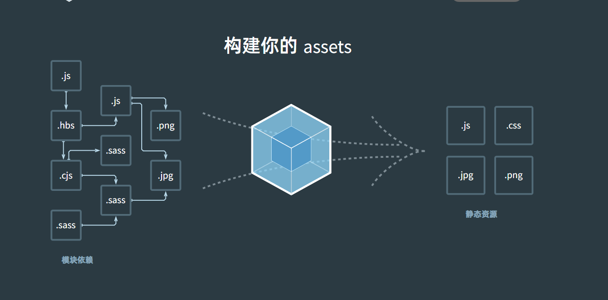

#### 2. Webpack 的概念

```
webpack 处理应用程序时,它会在内部从一个或多个入口点构建一个 依赖图(dependency graph),然后将你项目中所需的每一个模块组合成一个或多个 bundles,它们均为静态资源,用于展示我们的内容
```

#### 3. 为什么要使用 Webpack

1. Webpack 有效的防止了污染全局变量,解决了传统开发时的作用域问题

2. Webpack 会将模块进行打包拆分,可以优化网络加载慢时的白屏效果

3. 传统开发的前端代码通常会有可读性差和可维护性差的问题,Webpack 可以规范项目的开发,让项目后续的维护更加简单,可读性更强

#### 4. webpack 搭建项目流程

1. 初始化项目

   ```js
   // 1. 创建项目文件夹
   mkdir webpack-demo

   // 2. 跳转到项目的根路径
   cd ./webpack-demo

   // 3. 初始化npm
   npm init -y  或  npm init

   // 4. 安装webpack和webpack-cli
   npm install webpack webpack-cli --save-dev
   // 或
   yarn add webpack webpack-cli --save-dev
   ```

2. 创建项目目录

   ```js
   // 1. 创建src,public文件夹,他们分别表示源代码和静态资源
   mkdir src public

   // 2. src目录下创建index.js,他表示项目的入口js

   // 3. 创建index.html,它表示项目的最终结果,并且内部要引入src下的index.js
   // index.html
     <!DOCTYPE html>
     <html>
       <head>
         <meta charset="utf-8" />
         <title>起步</title>
         <script src="https://unpkg.com/lodash@4.17.20"></script>
       </head>
       <body>
         <script src="./src/index.js"></script>
       </body>
     </html>
   ```

3. 配置 webpack.config.js 与 package.json

   ```js
   // package.json填写项目信息
     {
     "name": "webpack-demo", // 项目名称
     "version": "1.0.0", // 项目版本
     "description": "", // 项目介绍
     "main": "index.js", // 项目入口
     "private": true, // 表示安装包为私有的
     // 自定义命令脚本
     "scripts": {
       "build": "webpack" // 执行打包命令
     },
     "keywords": [], // 关键字
     "author": "", // 作者
     "license": "MIT", // 开源协议
     // 开发环境配置
     "devDependencies": {
       "webpack": "^5.38.1",
       "webpack-cli": "^4.7.2"
     }
   }

   // webpack.config.js 配置webpack
   const path = require('path');

     module.exports = {
       entry: './src/index.js', // webpack解析的入口
       // 打包的出口路径与文件名
       output: {
         filename: 'main.js',
         path: path.resolve(__dirname, 'dist'),
       },
       // ...其余配置
     };
   ```

4. 打包项目

   ```js
   npm run build
   // 或
   yarn build
   ```

## 02-webpack 的核心概念点

#### 1. [入口起点(entry)](https://webpack.docschina.org/concepts/entry-points)

1. 入口的作用

   ```
   入口是webpack用来构建内部依赖图的开始点,它指示了webpack应该使用哪个模块来作为构建内部依赖图的开始,进入入口之后webpack会找出哪些模块和库是入口起点(直接和间接)依赖的
   ```

2. webpack.config.js 中配置入口

   ```js
   // 用法：entry: string | [string]

   webpack.config.js;

   // 单个入口语法
   module.exports = {
     entry: {
       main: './path/to/my/entry/file.js',
     },
   };

   // 单个入口语法(简写)
   module.exports = {
     entry: './path/to/my/entry/file.js',
   };

   // 多个个入口语法
   module.exports = {
     entry: ['./src/file_1.js', './src/file_2.js'],
   };
   ```

3. 入口的默认值

   默认是./src/index.js,但是可以通过在 webpack.config.js 中配置 entry 属性来指定一个或者多个不同的入口起点

4. 对象语法

   > 对象语法会比较繁琐。但这是应用程序中定义入口的最可扩展的方式。

   ```js
   // 用法：entry: { <entryChunkName> string | [string] } | {}

   /**
    * 参数介绍
    * @params dependOn:当前入口文件所依赖的入口,它必须要在入口文件加载之前被加载(简单理解:入口文件的依赖文件,需要在入口文件加载前被加载)
    * @params filename:指定要输出的文件名称
    * @params import:启动的时候需要加载的模块
    * @params library:指定library选项,给当前entry(入口)构建一个library
    * @params runtime:运行时chunk的名字,如果设置了,就会创建一个新的运行时chunk,在webpack5.43.0之后可以将其设置为false,来避免创建一个新的运行时chunk
    * @params publicPath:指定入口的输出文件的公共URL地址
    * @params vendor:指定一些第三方库的入口文件路径,这样你可以在 vendor.js 中存入未做修改的必要 library 或文件(例如 Bootstrap, jQuery, 图片等),然后将它们打包在一起成为单独的 chunk。内容哈希保持不变,这使浏览器可以独立地缓存它们,从而减少了加载时间。
    ......
    */
   module.exports = {
     entry: {
        dependOn,
        filename,
        import,
        library,
        runtime,
        publicPath,
      },
   };
   ```

   > 在 webpack < 4 的版本中,通常将 vendor 作为一个单独的入口起点添加到 entry 选项中,以将其编译为一个单独的文件(与 CommonsChunkPlugin 结合使用)。

#### 2. [输出(output)](https://webpack.docschina.org/concepts/output/)

1. output 的作用:可以通过配置 output 选项,告知 webpack 如何向硬盘写入编译文件。注意,即使可以存在多个 entry 起点,但只能指定一个 output 配置。

2. 用法

   ```js
   // webpack配置中,output属性的要求是将它的值设置为一个对象,然后为输出文件的文件名配置一个output,filename

   module.exports = {
     output: {
       // 指定输出的文件名称,最终会存放在dist中
       filename: 'bundle.js',
     },
   };
   ```

3. 多个入口起点

   ```js
   // 如果配置中多出一个chunk,则应该使用占位符来保证每个文件具有唯一的名称
   module.exports = {
     entry: {
       app: './src/app.js',
       search: './src/search.js',
     },
     output: {
       // 这里的[name]就是占位符,具体的占位符还有[file], [query], [fragment], [base] 与 [path]
       filename: '[name].js',
       path: __dirname + '/dist',
     },
   };
   ```

4. 动态设置 output 的 publicPath

   ```js
   // 如果在编译的时候,不知道最终输出文件的publicPath是什么地址,可以先将其置空,在运行的时候通过入口起点文件中的__webpack_public_path__动态的设置
   __webpack_public_path__ = 'publicPath地址';
   ```

#### 3. [loader](https://webpack.docschina.org/concepts/loaders/)

1. loader 简介

> loader 的作用:loader 用于对模块的源代码进行转换。loader 可以使我们在使用 import 或者 load 加载模块时预处理文件。可以将不同的代码,模块转换为浏览器可识别的代码,模块

> loader 的概念:loader 类似于其他构建工具中的 **task(任务)** 并且提供了处理前端构建步骤的得力方式.loader 可以将文件从不同的语言 **(例如 TypeScript,Sass 等)** 转换为 JS 或 CSS 代码,loader 允许我们直接在 js 模块中 import CSS 文件

2. loader 使用

   ```js
   // 1. 使用示例
   // 下载ts转换和css转换对应的loader
   npm install --save-dev css-loader ts-loader

   // webpack.config.js中进行配置,表示以.css和.ts为后缀的文件通过指定的loader进行转换
   module.exports = {
    loader:{
      rules: [
        { test: /\.css$/, use: 'css-loader' },
        { test: /\.ts$/, use: 'ts-loader' },
      ],
    }
   }

   // 2. 使用loader
   // 配置方式:在 webpack.config.js 文件中进行配置,指定 loader和匹配的文件后缀
   // 内联方式:在每个import语句中指定loader

   // 内联方式使用示例:
   // 使用!将资源中的loader分开,并且可以禁用掉已配置的normal loader(普通loader)
   import styles from '!style-loader!css-loader?modules!./styles.css'

   // 使用!!前缀,将禁用所有已经配置的loader(preloader,postloader,loader)
   import styles from '!!style-loader!css-loader?modules!./styles.css';

   // 使用-!前缀,将禁用所有已配置的 preLoader 和 loader,但是不禁用postLoaders
   import styles from '-!style-loader!css-loader?modules!./styles.css';

   // 选项中可以按照url查询参数的格式传递参数,或者也可以为一个JSON对象
   import styles from '-!style-loader!css-loader??key=value&foo=bar!./styles.css?{"key":"value","foo":"bar"}';
   ```

3. loader 的特性

   ```js
   // 1. loader 支持链式调用:上一个loader的输出会成为下一个loader的输入,最后的loader返回的就是最终的结果
   module.exports = {
     module: {
       rules: [
         {
           // 匹配所有sass文件
           test: /\.scss$/,
           // 链式调用不同的loader:将css插入到style标签中->解析css文件->将sass代码转换为css代码
           use: ['style-loader', 'css-loader', 'sass-loader'],
         },
       ],
     },
   };

   // 2. loader 可以是同步,也可以是异步,这也就意味着在文件转换过程中,可以根据自己的需要选择合适的加载方式

   // 2-1:同步loader:指在文件转换过程中,立即执行并返回结果,这种类型的loader通常用于简单的转换任务,不涉及复杂的异步操作,同步loader将文件转换为js之后,会将其传递给webpack继续处理
   module.exports = function (source) {
     // 同步loader示例,直接返回转换结果
     return source.replace('foo', 'bar');
   };

   // 2-2:异步loader:指在文件转换中异步操作,例如远程请求,文件读取等等,这种类型的loader通常用于耗时较长或需要进行IO操作的转换任务,异步loader通过回调或者promise来处理异步操作,并在完成后将结果传递给webpack
   module.exports = function (source, map, callback) {
     // 异步loader示例,使用setTimeout模拟异步操作
     setTimeout(() => {
       const result = source.replace('foo', 'bar');
       callback(null, result);
     }, 1000);
   };

   /**
    * 3. webpack 运行在 nodejs 中,使得 loader 的可操作性更强
    *   运行在Nodejs中的优点
    *     3-1.完整的Nodejs生态系统:Nodejs有强大的生态系统,内置了很多有用的模块与工具,loader可以使用这些模块与工具来完成各种任务,例如文件读写(这也是为什么webpack必须要在nodejs环境下的主要原因),文件请求等等,这样可以使开发者更轻松的在loader中执行各种操作
    *     3-2.灵活的转换逻辑:由于loader在Nodejs中运行,它可以执行任何js代码,这意味着开发者可以根据需求编写更复杂的逻辑,使得在loader中编写逻辑变得更加灵活和可拓展
    *     3-3.与外部系统的交互:由于运行在nodejs中,loader可以与外部系统进行交互,例如调用其他命令行工具,数据库查询,API调用等等,这使得loader可以在构建过程中与其他服务器和工具进行继承,实现更复杂的转换与处理
    */

   // 4. 模块转换:loader可以将各种文件(css,less,图片,字体等等)转换为js模块,使它们可以被webpack正确的解析与处理

   // 转换所有的.css文件
   module.exports = {
     module: {
       rules: [
         {
           test: /.css$/,
           use: ['style-loader', 'css-loader'],
         },
       ],
     },
   };
   // 转换所有的图片文件
   module.exports = {
     module: {
       rules: [
         {
           test: /\.(ttf|eot|woff)$/,
           use: ['url-loader'],
         },
       ],
     },
   };
   // ......

   // 5. 配置选项:loader提供了options对象来配置的选项机制,通过在webpack.config.js中指定loader的options属性,可以传递一些配置参数给loader,自定义行为
   // options配置,并且自定义loader处理函数
   // replace-loader.js(这种将loader抽离出来,自己开发也被称为loader插件)
   module.exports = function (source) {
     const { search, replace } = this.query; // 从options中获取参数
     return source.replaceAll(search, replace);
   };
   // webpack.config.js
   module.exports = {
     module: {
       rules: [
         {
           // 匹配所有.txt文件
           test: /.txt$/,
           use: [
             {
               // 配置loader,并通过options传递参数
               loader: 'replace-loader',
               options: {
                 search: 'Hello',
                 replace: 'Hi',
               },
             },
           ],
         },
       ],
     },
   };

   // 6. 加载器顺序:loader可以通过enforce属性指定加载顺序,属性值为pre表示该loader会在其他普通loader之前执行,为post表示在其他普通loader之后执行
   // webpack.config.js
   module.exports = {
     module: {
       rules: [
         {
           test: /\.js$/, // 匹配所有.js文件
           enforce: 'pre', // 在其他普通loader之前执行
           use: 'eslint-loader', // 使用eslint-loader进行代码检查
         },
         {
           test: /\.js$/, // 匹配所有.js文件
           use: 'babel-loader', // 使用babel-loader进行转换
         },
         {
           test: /\.css$/, // 匹配所有.css文件
           enforce: 'post', // 在其他普通loader之后执行
           use: 'style-loader', // 使用style-loader将CSS注入到页面中
         },
       ],
     },
   };

   // 7. 条件匹配:使用test属性指定哪些文件需要被当前loader处理,可以使用正则表达式或者函数来匹配文件路径,来确认一些文件是否由该loader处理
   // webpack.config.js 通过正则/函数匹配满足条件的文件进行loader转换
   module.exports = {
     module: {
       rules: [
         {
           // 正则 匹配所有js文件
           // test: /\.js$/,
           // 函数 匹配所有css文件
           test: fileName => {
             // 检查是否包含.js和是否以.js结尾
             return fileName.includes('.js') && fileName.endsWith('.js');
           },
           // 如果只有一个loader则不需要写为数组格式
           use: 'babel-loader',
         },
       ],
     },
   };
   ```

4. 解析 loader

   > 解析(Resolving) loader 是 webpack 中的一个重要过程,在这个阶段将确定 loader 应该应用于哪些文件,并找到这些文件所在的位置

   1. 直接匹配: 如果 loader 配置中使用来具体的 loader 名称(例如 css-loader),webpack 会尝试从项目的 node_modules 中直接加载这个 loader
   2. 相对路径匹配: 如果 loader 配置中使用了相对路径,webpack 就会从当前路径开始找到这个相对路径加载 loader
   3. 模块路径匹配: 如果 loader 中配置了一个简单的标识符,webpack 会使用 resolveLoader 配置项中指定的解析规则来查找这个 loader,resolveLoader 可以配置模块解析的细节,例如指定 loader 的搜索目录,别名等等
   4. 递归查找:如果以上步骤都无法找到 loader,那么 webbapck 将按照从左到右的顺序应用这些 loader,也就是说将 loader 链中的最后一个 loader 先执行,然后将结果传递给前一个 loader,以此类推

   补充:通过解析 loader,webpack 可以找到正确的 loader 并按照指定的顺序应用这些 loader,这使得我们可以更轻松的配置和使用各种类型的 loader 来处理项目中的不同文件

   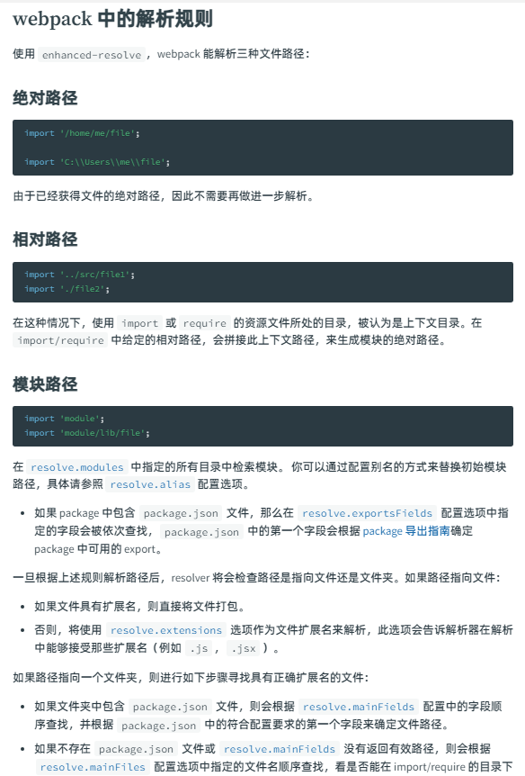
   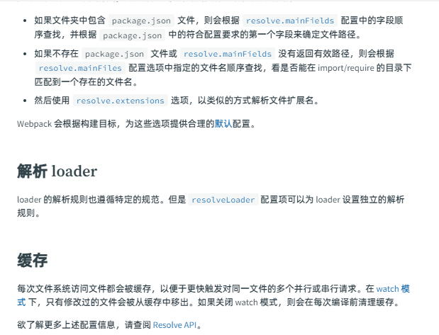

#### 4. [插件(plugin)](https://webpack.docschina.org/concepts/plugins/)

1. 插件的作用:

   ```txt
   插件是webpack的支柱功能,webpack本身也是构建与在webpack配置中用到的相同的插件系统之上,插件的目的是解决loader无法实现的其他事,并且webpack本身也提供了很多插件
   ```

   > 如果在插件中使用了 webpack-sources 的 package,请使用 require(;webpack).sources 替代 require('webpack-sources'),以避免持久缓存的版本冲突

2. 插件的概念与系统的运作方式

   ```js
   /**
    * 插件的概念:
    * webpack插件是一个具有apply方法的js对象,apply方法会被webpack compiler调用,并且在整个编译生命周期都可以访问compiler对象
    *
    * 概念解释:
    * 1.webpack compiler:webpack compiler是webpack的核心组件之一,负责管理整个编译过程,它会加载配置文件,创建依赖图,执行模块转换,生成输出文件等操作
    * 2.apply方法:当我们开发一个webpack插件时,需要创建一个js对象,并且该对象上实现一个apply方法,webpack在编译过程中会调用该方法,并且将compiler对象作为参数传入
    * 3.compiler对象:compiler对象时webpack compiler的一个实例,它包含了编译过程中的各种信息与方法,在插件的apply中,可以通过使用compiler对象来访问和修改编译过程中的状态
   
    补充:通过插件的apply方法,可以注册钩子函数来监听编译过程中的不同回调事件,在特定的时机执行自定义的逻辑
    */
   //

   // plugin.js
   const pluginName = 'plugin';

   class Plugin {
     // 在 apply 方法中处理编译过程中的事件
     apply(compiler) {
       // 注册一个编译开始前的钩子函数,compilation是webpack compilation的实例,可以通过compilation来获取webpack编译中的数据与放阿飞
       compiler.hooks.run.tap(pluginName, compilation => {
         console.log('webpack构建正在启动');
       });

       // 注册一个编译完成后的钩子函数
       compiler.hooks.done.tap(pluginName, compilation => {
         console.log('Compilation has finished.');
       });
     }
   }
   ```

3. 插件的配置

   ```js
   // webpack.config.js
   const 插件名 = require('插件路径');
   module.exports = {
     entry: '入口文件路径',
     output: {
       filename: '出口文件名',
       // 出口文件路径
       path: path(__dirname, 'dist'),
     },
     // 插件配置
     plugins: [new 插件名(传递给插件的参数)],
   };
   ```

#### 5. [配置(Configuration)](https://webpack.docschina.org/concepts/configuration/)

1. 对配置的理解: webpack 的配置文件是 js 文件,文件内部导出了一个 webpack 配置的对象,webpack 会根据配置定义的属性对打包进行处理

2. 配置的规范:

   ```js
   // webpack 遵循 CommonJS 模块规范,所以可以在配置中使用,所以可以在配置中使用以下几种方法
   // 1. 通过require(...)引入其他文件到webpack.config.js中
   // 2. 通过require(...)使用npm下载的工具函数
   // 3. 使用js控制流表达式,例如?:操作符
   // 4. 对value使用常量或者变量赋值
   // 5. 编写并执行函数,生成部分配置
   ```

3. 基础配置

   ```js
   module.exports = {
     // 环境:dev(开发)环境
     mode: 'development',
     // 入口
     entry: './foo.js',
     // 出口
     output: {
       path: path.resolve(__dirname, 'dist'),
       filename: 'foo.bundle.js',
     },
     // ......
   };
   ```

4. [使用其他语言配置 webpack.config.js](https://webpack.docschina.org/configuration/configuration-languages/)

   ```txt
   typescript,coffeeScript,babel and JSX, ......
   ```

#### 6. [模块(Modules)](https://webpack.docschina.org/concepts/modules/)

1. 模块的概念

   1. 软件开发模块的概念: 模块通常是指程序的一个独立部分,它具有一定的功能与责任,并且可以被独立开发,测试,维护和复用。
   2. webpack 中模块的概念: webpack 中,模块就是指被打包的各个文件,这些文件可以为 js 文件,png 图片,字体文件等等,webpack 将他们视为模块,并且通过加载器(loader)和插件(plugin)进行处理

2. webpack 支持的模块类型

   ```js
   /**
    * webpack 直接支持的模块类型
    *   ECMAScript 模块
    *   CommonJS模块
    *   AMD模块
    *   Assets
    *   WebAsembly模块
    * webpack 经过loader处理可以支持的模块类型
    *   CoffeeScript
    *   TypeScript
    *   ESNext (Babel)
    *   Sass
    *   Less
    *   Stylus
    *   Elm
    */
   ```

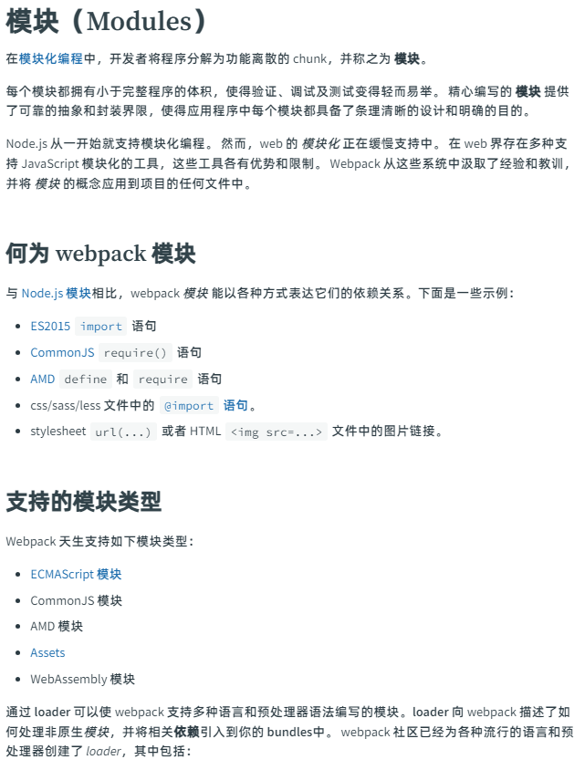
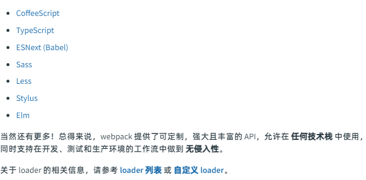

#### 7. [模块解析(Module Resolution)](https://webpack.docschina.org/concepts/module-resolution/)

1. 模块解析简介

webpack 中的模块解析是指 webpack 在打包的过程中,根据给定的模块导入路径来确定要使用的实际模块文件,webpack 提供了强大而灵活的模块解析功能,可以识别各种类型的模块导入方式,并根据配置找到正确的模块文件,这可以使得开发者可以更简洁,灵活的方式引入模块,无需关注模块本身的路径

2. 模块解析的相关规则与概念

   ```txt
   1. 解析规则:
      webpack中通过配置解析规则来识别不同的模块导入方式,这些规则告诉webpack如何解析和处理不同类型的导入语句,常见的解析规则包括对js,css,json等文件的解析配置

   2. 解析器:
      解析器负责将导入语句转换为模块的实际路径,webpack提供了多个内置的解析器,用于处理不同类型的导入语句,例如resolve.moduels配置项指定了webpack在哪些目录下查找模块,resolve.extensions配置项指定了webpack允许解析哪些拓展名的文件

   3. 解析顺序:
      webpack会按照特定的解析顺序来查找模块,通常情况下,webpack首先会查找本地模块,然后是项目依赖的第三方模块,可以通过配置的resolve.modules和resolve.alias等选项来修改解析顺序

   4. 解析插件:
      webpack提供了解析插件机制,允许开发者自定义模块解析过程,例如可以使用resolve.plugins配置项添加自定义的解析插件,以支持额外的解析功能或处理特定类型的模块导入

   ```

3. webpack 中的解析规则

   ```js
   // 1. 绝对路径,由于这里已经获取到了文件的最终路径,所需不需要进行二次解析
   import '/home/me/file';
   // 或
   import 'C:\\Users\\me\\file';

   // 2. 相对路径,在这种情况下,使用import或者require的资源文件所处的目录被认为是上下文目录,在import/require中给定的文件路径会拼接这个上下文路径,生成绝对路径查找到文件
   import '../src/file1';
   // 或
   import './file2';

   // 3. 模块路径,这里不是绝对路径也不是相对路径,webpack就会识别为一个第三方模块,会根据配置的resolve.modules中指定的所有目录来检索模块,如果没有进行配置,webpack就会以默认的规则去查找该模块(webpack会从当前文件所在的目录开始向上级目录逐层差早,直到找到项目根目录,然后,在项目根目录下的node_modules文件夹中查找对应的模块),如果没有找到该模块,webpack会抛出对应的错误
   import 'module';
   // 或
   import 'module/lib/file';
   ```

4. webpack 中配置模块别名

   ```js
   // webpack.config.js
   module.exports = {
     entry: '入口...',
     output: '出口...',
     resolve: {
       // 这里表示设置/src路径的模块别名为@ 在导入模块时使用@会自动替换为/src
       alias: {
         '@': '/src',
       },
     },
   };
   ```

#### 8. [模块联合(Module Federation)](https://webpack.docschina.org/concepts/module-federation/)

1. 模块联合的介绍

   - 概念:多个独立的构建可以组成一个应用程序,这些独立的构建之间不应该存在依赖关系,因此我们可以单独的开发和部署这些模块,这通常被称为微前端

   - 介绍:webpack5 的 module Federation 的功能非常强大,它允许将多个独立的 webpack 进行构建(也被成为 Federated Modules)组合为一个整体应用程序. module Federation 借助远程加载和共享依赖的能力,可以使构建,部署,维护微前端架构变得更加简单

   - 优点:
     - 代码隔离: 每个子应用使用不同的技术栈和技术,并且独立开发,测试和部署
     - 资源共享: 子应用可以共享依赖和模块,避免了重复加载和存储相同的代码
     - 灵活性: 应用层序可以根据需要动态的加载和卸载其子应用,实现按需加载和解耦
     - 性能优化: 通过异步加载子应用,减少了初始加载的时间,并允许按需预取和缓存一些模块
     - 团队协作: 通过拆分应用程序为独立的子应用,不同团队可以并行开发,提高开发效率

   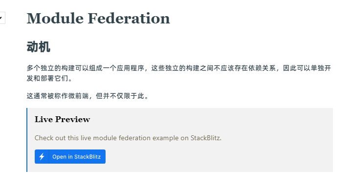

2. 模块联合使用示例(见 05-模块联合使用示例)

#### 9. [依赖图(dependency graph)](https://webpack.docschina.org/concepts/dependency-graph/)

1. 依赖图简介:

   - 依赖图是一个表示模块之间关系的图形结构,用于确定项目中各个模块之间的依赖关系,描述了应用程序中所有模块的关系,并且确认了模块的加载顺序
     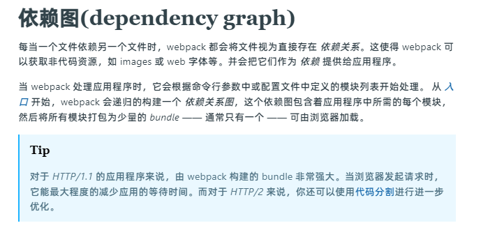

2. 依赖图的组成元素:
   - 入口(entry):webpack 从配置文件的指定一个或多个入口开始构建依赖图,每个入口点代表一个主要的模块,webpack 从这个模块开始构建整个依赖树
   - 模块(module):模块是具有独立功能的代码单元,可以是 js 文件,css 文件,webpack 将每个文件视为一个资源,并将其分配一个唯一的标识符
   - 依赖(dependency):一来是模块之间的引用关系,当一个模块导入另一个模块的时候,webpack 将创建一个依赖关系来表示这种应用关系,依赖可以是相对路径,绝对路径,模块名称等等
   - chunk:Chunk 是指模块构建过程中的代码块,它由一组相互依赖的模块组成,webpack 将根据入口和导入关系将模块分组到不同的 chunk 中,以此实现按需加载和并行加载
   - 资源(assets):资源师构建过程中生成的最终输出文件,例如 js 文件,css 文件,图片等,每个 chunk 最终都会生成一个或多个 chunk
3. 图解 webpack 编译流程

   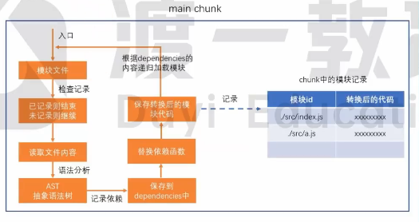

#### 10. [目标(target)](https://webpack.docschina.org/concepts/targets/)

1. 目标(target)的概念:由于 js 的作用范围较大,不仅可以用来写前端的代码,也可以用来写服务端的代码,target 就是用来指向 js 在什么环境下编辑代码,例如*target:'node'*就表示 js 会在 node 环境下编译代码

2. 目标(target)的用法:

   ```js
   // 在node环境下编译代码,这样就可以在代码中使用path以及fs等node宿主环境下的专属API了,并且浏览器的一些DOM和BOM的API也无法使用了
   // webpack.config.js
   module.exports = {
     target: 'node',
   };
   ```

3. 配置多个 target:

   ```js
   const path = require('path');
   const serverConfig = {
     target: 'node',
     output: {
       path: path.resolve(__dirname, 'dist'),
       filename: 'lib.node.js',
     },
     //…
   };
    const clientConfig = {
    target: 'web', // <=== 默认为 'web',可省略
    output: {
    path: path.resolve(\_\_dirname, 'dist'),
    filename: 'lib.js',
    },
    //…
    };

    // 这样打包时将会在dist文件夹下创建lib.js和lib.node.js两个不同环境下的代码
    module.exports = [serverConfig, clientConfig];
   ```

#### 11. [manifest](https://webpack.docschina.org/concepts/manifest/)

1. manifest 介绍

   - 为什么需要 manifest :当使用 webpack 构建应用程序的时候,它会将所有的模块,资源和依赖关系打包到一个或者多个输出文件中,这样会导致原始的/src 下的源代码目录结构被修改,这样就会产生在浏览器环境下如何正确的加载和链接应用程序所需的各个模块与资源的问题,manifest 就是为了解决这个问题而出现的

   - manifest 如何产生的:当 webpack 在构建过程中解析和映射应用程序的时候,它会创建一个数据集合,这个数据集合就是 manifest,它包含了构建过程中生成的所有模块的详细信息,包括模块的标识符,依赖关系等等

   - manifest 的作用:webpack 通过 manifest 来管理模块之间的交互,manifest 包含了每个模块的标识符,可以使浏览器端根据需要找到并加载对应的模块,通过 manifest,webpack 可以实现按需加载,代码分隔,动态导入等高级功能,从而提供更高效的应用程序与性能优化

2. manifest 文件内容介绍

   ```json
   // manifest.json
   {
     // 指定应用程序的完整名称
     "name": "My Web App",
     // 指定应用程序的短名称(如在桌面或应用程序列表中显示的名称)
     "short_name": "WebApp",
     // 指定应用程序的起始 URL,即用户访问应用时加载的初始页面
     "start_url": "/",
     // 指定应用程序的显示模式。常见的值有 "fullscreen"、"standalone"、"browser" 和 "minimal-ui"。这会影响应用程序如何以及在哪里显示,使其看起来更像一个独立的应用程序
     "display": "standalone",
     // 指定应用程序的背景颜色,当应用程序启动时使用。这可以为用户提供启动画面的背景色
     "background_color": "#ffffff",
     // 指定应用程序的主题颜色,影响浏览器的工具栏、任务栏等区域的外观
     "theme_color": "#4285F4",
     // 指定应用程序的图标。您可以提供多个不同尺寸和类型的图标,以便在不同设备或环境中使用
     "icons": [
       {
         "src": "icon.png",
         "sizes": "192x192",
         "type": "image/png"
       },
       {
         "src": "icon512.png",
         "sizes": "512x512",
         "type": "image/png"
       }
     ]
   }

   // index.html
   <link rel="manifest" href="manifest.json">
   ```

#### 12. [模块热替换(hot module replacement)](https://webpack.docschina.org/concepts/hot-module-replacement/)

1. 什么是模块热替换:模块热替换(HRM)功能会在应用程序运行的时候替换,添加或删除模块,而不需要重新加载整个页面,当代码被修改的时候,只有被修改的模块会被更新,而不会影响其他模块的状态

2. HRM 的优点:可以提高开发效率,减少了手动刷新页面的需要,通过 HRM,开发人员可以立即看到代码更改后的效果,从而快速迭代和调试应用程序

3. 启动与关闭 HRM

   ```js
   // 在webpack-dev-server 4.0.0开始,热替换模块默认是开启的
   const HtmlWebpackPlugin = require('html-webpack-plugin');
   const path = require('path');
   module.exports = {
     entry: '/src/main.js',
     output: {
       filename: 'main.js',
       path: path.resolve(__dirname, 'dist'),
     },
     // 开发环境
     mode: 'development',
     plugins: [
       // 配置开发服务器中使用的html路径
       new HtmlWebpackPlugin({
         template: './index.html',
       }),
     ],
     // 开发服务器配置
     // hot: 控制热更新的开关
     // liveReload: 控制实时重新加载的开关
     // 只有hot和liveLoad全部关闭才算是真正的关闭热替换,因为liveReload启动会导致页面刷新,另一种程度上实现了模块的热替换
     devServer: { static: path.join(__dirname, ''), compress: true, port: 5050, hot: false, liveReload: false },
   };
   ```

#### 13. [浏览器兼容性(browser compatibility)](https://webpack.docschina.org/concepts/#browser-compatibility)

Webpack 支持所有符合 ES5 标准的浏览器(不支持 IE8 及以下版本),webpack 的 import()和 require.ensure()需要使用到 promise,如果想要支持低版本浏览器,在使用这些表达式之前,需要提前加载 polyfill

#### 14. [环境(environment)](https://webpack.docschina.org/concepts/#environment)

webpack 可以在 nodejs v10.13.0+ 版本中运行

## 03-webpack 使用指南


### 1. [起步](https://webpack.docschina.org/guides/getting-started/)

1. 基本安装

   ```js
   mkdir webpack-demo // 创建项目文件夹
   cd webpack-demo // 修改终端路径
   npm init -y // 初始化npm环境
   npm install webpack-cli webpack --save-dev // 下载webpack和webpack-cli到开发环境
   ```

2. 创建文件

   ```lua
    webpack-demo
      |- package.json  // npm init -y自动生成
      |- package-lock.json // 下载npm包时自动生成
      |- index.html // 项目根html文件
      |- /dist // 项目打包代码文件夹
        |- index.html // 项目主入口,这里是手动创建(可以通过配置自动生成)
      |- /src // 项目源代码文件夹
        |- index.js // 项目主入口
   ```

3. 编辑代码

   ```js
   // src/index.js
   import _ from 'lodash'
   function component() {
     const element = document.createElement('div');
     // 下载lodash库,并且使用import进行导入,这里直接使用_来使用lodash中的方法
     element.innerHTML = _.join(['Hello', 'world'], ' ');
     return element;
   }
   document.body.appendChild(component());
   // index.html
   <!DOCTYPE html>
   <html>
     <head>
       <meta charset="utf-8" />
       <title>起步</title>
       <script src="https://unpkg.com/lodash@4.17.20"></script>
     </head>
     <body>
       <script src="./src/index.js"></script>
     </body>
   </html>
   // package.json
   // 1. 添加private:true,并且移除main:index.js入口,保证代码为私有的,避免意外发布代码
   // 2. 添加scripts自定义脚本"build":"webpack" 这样执行npm run build 的时候就会执行webpack指令,这样就可以打包代码到dist文件夹中了
   ```

4. 使用配置文件
   ```js
   // 项目根目录添加webpack.config.js文件,这个文件就是项目webpack的配置文件
   // webpack.config.js
   const path = require('path');
   module.exports = {
     // 项目入口文件
     entry: 'src/index.js',
     // 项目出口配置
     output: {
       // 项目出口的文件名称
       filename: 'main1.js',
       // 项目出口的文件路径
       path: path.resolve(__dirname, '/dist'),
     },
   };
   ```

### 2. [管理资源](https://webpack.docschina.org/guides/asset-management/)

1. 加载 css

   ```js
   // 修改webpack起步中实例中部分内容,作为管理资源的demo

   // 下载css-loader和style-loader加载css样式
   npm install style-loader css-loader

   // 添加加载器
   // webpack.config.js
   const path = require('path');
   module.exports = {
   // 项目入口文件
   entry: '/src/index.js',
   // 项目出口配置
   output: {
    // 项目出口的文件名称
    filename: 'main.js',
    // 项目出口的文件路径
    path: path.resolve(__dirname, 'dist'),
   },
   // 设置模块应用的加载器
   module: {
      rules: [
        {
          // 设置css文件应用下面use的loader
          test: /.css$/i,
          // 设置文件所使用的loader
          use: ['styles-loader', 'css-loader'],
        },
      ],
    },
   };
   ```

2. 加载图片

   ```js
   // webpack.config.js中添加对.png .jpg .svg .jpeg .gif的加载,这里使用webpack内置的Assets Modules 所以不需要单独下载插件
   const path = require('path');
   module.exports = {
     // 项目入口文件
     entry: '/src/index.js',
     // 项目出口配置
     output: {
       // 项目出口的文件名称
       filename: 'main.js',
       // 项目出口的文件路径
       path: path.resolve(__dirname, 'dist'),
     },
     // 设置模块应用的加载器
     module: {
       rules: [
         {
           // 设置css文件应用下面use的loader
           test: /.css$/i,
           // 设置文件所使用的loader
           use: ['styles-loader', 'css-loader'],
         },
         {
           test: /\.(png|jpg|svg|jpeg|gif)$/i,
           type: 'asset/resource',
         },
       ],
     },
   };
   ```

3. 加载字体

   ```js
   // webpack.config.js中添加对.woff .woff2 .eot .ttf .otf的加载,这里使用webpack内置的Assets Modules 所以不需要单独下载插件
   const path = require('path');
   module.exports = {
     // 项目入口文件
     entry: '/src/index.js',
     // 项目出口配置
     output: {
       // 项目出口的文件名称
       filename: 'main.js',
       // 项目出口的文件路径
       path: path.resolve(__dirname, 'dist'),
     },
     // 设置模块应用的加载器
     module: {
       rules: [
         {
           // 设置css文件应用下面use的loader
           test: /.css$/i,
           // 设置文件所使用的loader
           use: ['styles-loader', 'css-loader'],
         },
         {
           test: /\.(png|jpg|svg|jpeg|gif)$/i,
           type: 'asset/resource',
         },
         {
           test: /\.(woff|woff2|eot|ttf|otf)$/i,
           // 使用webpack的内置加载器处理器
           type: 'asset/resource',
         },
       ],
     },
   };
   ```

4. 加载数据

   ```js
   const path = require('path');
   module.exports = {
     // 项目入口文件
     entry: '/src/index.js',
     // 项目出口配置
     output: {
       // 项目出口的文件名称
       filename: 'main.js',
       // 项目出口的文件路径
       path: path.resolve(__dirname, 'dist'),
     },
     // 设置模块应用的加载器
     module: {
       rules: [
         // 对css的加载处理
         {
           // 设置css文件应用下面use的loader
           test: /.css$/i,
           // 设置文件所使用的loader
           use: ['styles-loader', 'css-loader'],
         },
         // 对图片的加载处理
         {
           test: /\.(png|jpg|svg|jpeg|gif)$/i,
           type: 'asset/resource',
         },
         // 对字体的加载处理
         {
           test: /\.(woff|woff2|eot|ttf|otf)$/i,
           // 使用webpack的内置加载器处理器
           type: 'asset/resource',
         },
         // 对csv的加载处理
         {
           test: /\.csv$/i,
           // 单独下载csv-loader(npm install csv-loader)
           use: ['csv-loader'],
         },
         // 对xml的加载处理
         {
           test: /\.xml$/i,
           // 单独下载xml-loader(npm install xml-loader)
           use: ['xml-loader'],
         },
       ],
     },
   };
   ```

5. 自定义 JSON 模块解析器

   ```js
   // 导入各个加载器
   const toml = require('toml');
   const yaml = require('yamljs');
   const json5 = require('json5');

   const path = require('path');
   module.exports = {
     // 项目入口文件
     entry: '/src/index.js',
     // 项目出口配置
     output: {
       // 项目出口的文件名称
       filename: 'main.js',
       // 项目出口的文件路径
       path: path.resolve(__dirname, 'dist'),
     },
     // 设置模块应用的加载器
     module: {
       rules: [
         // 对css的加载处理
         {
           // 设置css文件应用下面use的loader
           test: /.css$/i,
           // 设置文件所使用的loader
           use: ['styles-loader', 'css-loader'],
         },
         // 对图片的加载处理
         {
           test: /\.(png|jpg|svg|jpeg|gif)$/i,
           type: 'asset/resource',
         },
         // 对字体的加载处理
         {
           test: /\.(woff|woff2|eot|ttf|otf)$/i,
           // 使用webpack的内置加载器处理器
           type: 'asset/resource',
         },
         // 对csv的加载处理
         {
           test: /\.csv$/i,
           // 单独下载csv-loader(npm install csv-loader)
           use: ['csv-loader'],
         },
         // 对xml的加载处理
         {
           test: /\.xml$/i,
           // 单独下载xml-loader(npm install xml-loader)
           use: ['xml-loader'],
         },
         // 对toml文件的解析
         {
           test: /\.toml$/i,
           // 指定解析为json类型
           type: 'json',
           // 自定义解析器(使用toml库的parse方法来解析toml文件为json)
           parser: {
             parse: toml.parse,
           },
         },
         // 对yaml文件的解析
         {
           test: /\.yaml$/i,
           // 指定解析为json类型
           type: 'json',
           // 自定义解析器(使用yaml库的parse方法来解析yaml文件为json)
           parser: {
             parse: yaml.parse,
           },
         },
         // 对json5文件的解析
         {
           test: /\.json5$/i,
           // 指定解析为json类型
           type: 'json',
           // 自定义解析器(使用json5库的parse方法来解析json5文件为json)
           parser: {
             parse: json5.parse,
           },
         },
       ],
     },
   };
   ```

### 3. [管理输出](https://webpack.docschina.org/guides/output-management/)

1.  配置 HtmlWebpackPlugin

    ```js
    // 使用html-webpack-plugin,可以自动生成html文件,并且可以通过配置来指定html内的title等内容,并且script标签默认连接打包出来的的js
    // 1. 下载html-webpack-plugin
    npm install html-webpack-plugion --save-dev

    // 2. webpack.config.js中配置html-webpack-plugin
    const path = require('path');
    const HtmlWebpackPlugin = require('html-webpack-plugin');
    module.exports = {
      // 项目入口文件
      entry: '/src/index.js',
      // 项目出口配置
      output: {
        // 项目出口的文件名称
        filename: 'main.js',
        // 项目出口的文件路径
        path: path.resolve(__dirname, 'dist'),
      },
      // 配置插件
      plugins: [
        // 设置htmlwebpackplugin参数
        new HtmlWebpackPlugin({
          title: '管理输出',
        }),
      ],
    };

    // 3. 打包代码,此时就会自动生成html文件
    npm run build
    ```

### 4. [开发环境](https://webpack.docschina.org/guides/development/)

1. 使用 suoure map 追溯错误文件以及位置

   ```js
   // 1. 初始demo框架沿用09-webpack管理输出示例的文件
   // 2. 设置环境为开发环境(mode:development),并修改html-webpack-plugin中的title
   // 3. 配置soure-map

   // webpack.config.js
   const path = require('path');
   const HtmlWebpackPlugin = require('html-webpack-plugin');

   module.exports = {
     mode: 'development',
     entry: {
       index: './src/index.js',
       print: './src/print.js',
     },
     // 添加soure-map映射,当打包之后的代码发生错误时,会通过映射自动执行到对应的文件以及行和列中
     devtool: 'inline-source-map',
     plugins: [
       new HtmlWebpackPlugin({
         title: 'Development',
       }),
     ],
     output: {
       filename: '[name].bundle.js',
       path: path.resolve(__dirname, 'dist'),
       clean: true,
     },
   };
   ```

2. webpack 的观察模式

   ```js
   // webpack的观察模式依赖项目中所有文件的修改,当任意一个文件被修改后,代码都将会被重新编译,而不用再重新手动构建

   // 添加webpack观察自定义命令
   // package.json
   scripts:{
    "watch":"webpack --watch"
   }

   // 终端中执行npm run watch 或yarn watch 即可

   // 需要注意的是,watch无法主动触发刷新浏览器,所以当修改文件内容后,需要主动刷新一下浏览器
   ```

3. webpack-dev-serve 开发服务器

   ```js
   // 使用webpack-dev-serve配置开发服务器,可以在本地根据配置启动开发服务器,开发者通过开发服务器即可在浏览器中预览项目,并且开发服务器默认支持热更新,只要文件内容修改,浏览器会自动触发刷新重新构建

   // 1. 下载webpack-dev-serve
   npm install webpack

   // 2. webpack.config.js中配置开发服务器
   // webpack.config.js
   const path = require('path')
   const HtmlWebpackPlugin = require('html-webpack-plugin');

    module.exports = {
      // 设置环境
      mode: 'development',
      entry: {
        index: './src/index.js',
        print: './src/print.js',
      },
      devtool: 'inline-source-map',
      // 配置将dist文件夹作为开发服务器所使用的文件
      devServer: {
        static: './dist',
        // 配置开发服务器端口
        port:5050
      },
      plugins: [
        new HtmlWebpackPlugin({
          title: 'Development',
        }),
      ],
      output: {
        filename: '[name].bundle.js',
        path: path.resolve(__dirname, 'dist'),
        clean: true,
      },
      optimization: {
        runtimeChunk: 'single',
      },
    };

    // 3. 配置package.json启动webpacl-dev-serve的命令
    // package.json
    scripts:{
      "dev":"webpack serve --open"
    }
   ```

4. 使用 webpack-dev-middleware(webpack-dev-serve 开发服务器的核心也是依赖于 webpack-dev-middleware)

   ```js
   // 1. 下载express 和 webpack-dev-middleware
   npm install --save-dev express webpack-dev-middleware

   // 2. 修改配置文件,确保middleware(中间件)可以正常使用
   // webpack.config.js

   const path = require('path');
   const HtmlWebpackPlugin = require('html-webpack-plugin');

   module.exports = {
    mode: 'development',
    entry: {
      index: './src/index.js',
      print: './src/print.js',
    },
    devtool: 'inline-source-map',
    devServer: {
      static: './dist',
    },
    plugins: [
      new HtmlWebpackPlugin({
        title: 'Development',
      }),
    ],
    output: {
      filename: '[name].bundle.js',
      path: path.resolve(__dirname, 'dist'),
      clean: true,
      // 浏览器中访问打包后资源的公共路径
      publicPath: '/',
    },
   };
   // 3. 编写自定义开发服务器代码
   // 项目根目录创建server.js
   // server.js

   // 导入express,webpack,webpack-dev-midderware框架
    const express = require('express');
    const webpack = require('webpack');
    const webpackDevMiddleware = require('webpack-dev-middleware');

    // 创建app(express框架实例)
    const app = express();

    // 导入webpack配置文件
    const config = require('./webpack.config.js');

    // webpack的实例对象,通过compiler,可以使用webpack的一些方法来处理代码
    const compiler = webpack(config);

    // 告知 express 使用 webpack-dev-middleware,
    // 以及将 webpack.config.js 配置文件作为基础配置。
    app.use(
      webpackDevMiddleware(compiler, {
        publicPath: config.output.publicPath,
      })
    );

    // 将文件 serve 到 port 3000。
    app.listen(3000, function () {
      console.log('Example app listening on port 3000!\n');
    });


   // 4. 添加自定义命令,启动自定义开发服务器
   // package.json
   "scripts":{
    "server":"node server.js"
   }

   // 5. 自动打开浏览器
   // server.js
   // 导入express,webpack,webpack-dev-midderware框架
    const express = require('express');
    const webpack = require('webpack');
    const webpackDevMiddleware = require('webpack-dev-middleware');

    // 导入opn包,用于打开浏览器加载指定的url
    const opn = require('opn');

    // 创建app(express框架实例)
    const app = express();

    // 导入webpack配置文件
    const config = require('./webpack.config.js');

    // webpack的实例对象,通过compiler,可以使用webpack的一些方法来处理代码
    const compiler = webpack(config);

    // 告知 express 使用 webpack-dev-middleware,
    // 以及将 webpack.config.js 配置文件作为基础配置。
    app.use(
      webpackDevMiddleware(compiler, {
        publicPath: config.output.publicPath,
      })
    );

    // 将文件 serve 到 port 3000。
    app.listen(3000, function () {
      // 开发服务器成功后给出提示
      console.log('place open url http://localhost:3000 \n');

      // 打开浏览器加载此url
      opn('http://localhost:3000');
    });
   ```

### 5. [代码分离](https://webpack.docschina.org/guides/code-splitting/)

1. 简介

   代码分离是 webpack 中的特性之一,这个特性可以将代码分离到不同的 bundle 中,然后可以按需加载或者并行加载这些文件,代码分离可以用于获取更小的 bundle,控制资源加载优先级,如果使用合理的话,会极大减小加载的时间

   常用的代码分离方法有三种:

   - 入口起点: 使用 entry 配置手动的分离代码
   - 防止重复: 使用入口依赖或者 splitChunksPlugin 去重和分离 chunk
   - 动态导入: 通过模块的内联函数调用分离代码

   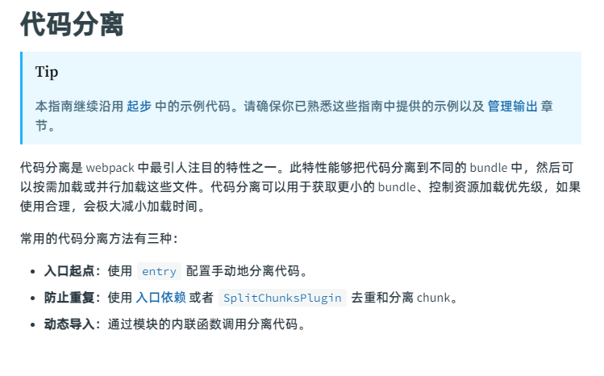

2. 入口起点代码分离

   ```js
   // 简介: 入口起点代码手动配置较多,存在一些隐患

   // 1. 创建项目框架(复用07-webpack起步示例框架)

   // 2. 创建src/another-module.js文件,用于配置入口起点

   // 3. 配置webpack.config.js实现代码分离
   // webpack.config.js
   const path = require('path');
   module.exports = {
     // 项目入口文件
     // entry: '/src/index.js',

     // 项目环境(开发环境dev)
     mode: 'development',

     // 配置项目入口
     entry: {
       index: './src/index.js',
       another: './src/another-module.js',
     },

     // 项目出口配置
     output: {
       // 项目出口的文件名称
       // filename: 'main.js',

       // 项目出口文件,将打包的出口文件命名为文件名.bundele.js,这里因为配置了两个项目的入口,所以最终会生成两个.bundle.js
       filename: '[name].bundle.js',

       // 项目出口的文件路径
       path: path.resolve(__dirname, 'dist'),
     },
   };

   // 存在的隐患:
   // 1. 如果入口chunk之间包含一些重复的模块,那么这些重复的模块都会被引入到各个bundle中
   // 2. 配置入口文件实现代码分离的这种方法不够灵活,并且不能动态的拆分应用程序逻辑中的核心代码
   ```

3. 防止重复

   ```js
   // 配置dependOn选项,使其可以在多个chunk中共享模块

   // webpack.config.js
   const path = require('path');
   module.exports = {
     // 项目入口文件
     // entry: '/src/index.js',

     // 项目环境(开发环境dev)
     mode: 'development',

     // 配置项目入口(指定入口文件与依赖关系)
     entry: {
       // 入口文件1
       index: {
         // 入口文件路径
         import: './src/index.js',
         // 指定模块的依赖关系与加载顺序
         dependOn: 'shared',
       },
       // 入口文件2
       another: {
         import: './src/another-module.js',
         dependOn: 'shared',
       },

       // 共享依赖->指向lodash,表示入口文件之间共享lodash依赖,通过这样的配置,webpack将会按照指定的依赖关系进行打包,这种方式可以更方便的管理多个入口文件,并共享一些公共的依赖模块
       shared: 'lodash',
     },

     // 项目出口配置
     output: {
       // 项目出口的文件名称
       // filename: 'main.js',

       // 项目出口文件,将打包的出口文件命名为文件名.bundele.js,这里因为配置了两个项目的入口,所以最终会生成两个.bundle.js
       filename: '[name].bundle.js',

       // 项目出口的文件路径
       path: path.resolve(__dirname, 'dist'),
     },

     // optimization配置用于对打包后的代码进行优化与分隔,这里是因为项目有多入口,所以需要配置optimization.runtimeChunk
     optimization: {
       // 此配置会将webpack的运行时代码提取到一个单独的文件中(运行时代码是指webpack在打包过程中生成的一些额外代码,通过使用single,webpack会为每个构建创建一个单独的运行时文件)
       runtimeChunk: 'single',
     },
   };
   ```

4. 使用 splitChunksPlugin 将公共的依赖模块提取到已有的入口 chunk 中

   ```js
   // webpack中配置splitChunksPlugin将公共的依赖提取到已有的chunk或者创建一个新的chunk中
   // 使用solitChunksPlugin之后,打包的代码将会多出单独的依赖文件

   // webpack.config.js
   const path = require('path');
   module.exports = {
     // 项目入口文件
     // entry: '/src/index.js',

     // 项目环境(开发环境dev)
     mode: 'development',

     // 配置项目入口
     entry: {
       index: './src/index.js',
       another: './src/another-module.js',
     },

     // 项目出口配置
     output: {
       // 项目出口的文件名称
       // filename: 'main.js',

       // 项目出口文件,将打包的出口文件命名为文件名.bundele.js,这里因为配置了两个项目的入口,所以最终会生成两个.bundle.js
       filename: '[name].bundle.js',

       // 项目出口的文件路径
       path: path.resolve(__dirname, 'dist'),
     },

     // optimization配置用于对打包后的代码进行优化与分隔,这里是因为项目有多入口,所以需要配置optimization.runtimeChunk
     optimization: {
       // 此配置会将webpack的运行时代码提取到一个单独的文件中(运行时代码是指webpack在打包过程中生成的一些额外代码,通过使用single,webpack会为每个构建创建一个单独的运行时文件)
       runtimeChunk: 'single',

       // 配置splitChunksPlugin来对依赖文件进行提取,以便实现代码的复用与减少重复加载,这样可以优化网页的性能,特别是在多入口的情况下
       splitChunks: {
         // chunks可以配置那些块(依赖\模块)可以被分隔,这里设置为all,表示所有的模块都会被分隔,并其通过这个配置,webpack将会根据公共的依赖关系自动设别与提取共享的模块,并将其打包进一个单独的文件中,这样,应用程序就不需要在每个文件里面重复的加载这些模块
         chunks: 'all',
       },
     },
   };
   ```

5. 动态导入

   - 使用 ECMAScript 的 import()语法实现动态导入,并且这也是推荐使用的方式

     ```js
     // import函数: 调用import函数会在内部使用promise,所以如果在旧版本浏览器中(例如IE中),是利用import(),需要使用到一个polyfill库来代替promsie(老版本浏览器不支持promise)

     // 1. 修改webpack.config.js

     // webpack.config.js
     const path = require('path');
     module.exports = {
       // 项目环境(开发环境dev)
       mode: 'development',

       // 配置项目入口
       entry: {
         index: './src/index.js',
       },

       // 项目出口配置
       output: {
         // 项目出口文件,将打包的出口文件命名为文件名.bundele.js,这里因为配置了两个项目的入口,所以最终会生成两个.bundle.js
         filename: '[name].bundle.js',

         // 项目出口的文件路径
         path: path.resolve(__dirname, 'dist'),
       },
     };

     // 2. 修改index.js代码,使用import()的形式导入lodash库并使用
     const element = document.createElement('div');

     // 使用import函数来动态的导入lodash库,这里将会返回一个promise,因此需要使用.then来获取proimise的结果(lodash库)
     import('lodash').then(({ default: _ }) => {
       element.innerHTML = _.join(['Hello', 'world'], ' ');
       document.body.appendChild(element);
     });

     // 3. 执行打包,预览效果
     yarn build 或 npm run build
     ```

6. 预加载与预获取模块

   - 简介: webpack 4.5.0 版本后增加了对预获取(prefetch)与预加载(preload)的支持,在声明 import 时,使用一些内置命令,可以让 webpack 在打包时对一些资源进行标识,以此来进行预加载和预获取

   prefetch(预获取): 将来某些导航下可能需要的资源
   preload(预加载): 当前导航下可能需要的资源

   - 示例:

     ```js
     // 对导入的模块标识预获取,这回生成<link rel="prefetch" href="/index.css">,并且追加到页面title部分,指示浏览器在页面空闲时区获取index.css文件
     import(/* webpackPrefetch: true */ 'index.css');
     ```

   - 补充:只要父 chunk 完成加载,webpack 就会添加预获取提示。

   - 预加载相对于预获取的不同之处

     - 加载时机:

       - 预加载: 预加载会在父 chunk 加载完成后立即开始加载,以并行方式进行加载,与主资源同时进行,目的是为了提前获取重要资源,并确保这些资源在后续需要的时候立即可用

       - 预获取: 预获取会在浏览器空闲时段异步的去请求这些未来可能需要用到的资源,并将其缓存起来,它会在主资源加载完成后,在浏览器空闲时区下载这些预获取的资源

     - 优先级:

       - 预加载: 预加载具有较高的优先级,因为它是当前页面许需要的关键资源

       - 预获取: 预解析具有中等优先级,因为它是将来可能会用到的资源

     - 请求时间:

       - 预加载: 预加载会立即发起请求,即使当前页面不需要这些资源

       - 预获取: 预解析会在浏览器空闲的时候再去请求资源

7. bundle 分析(**了解即可**)

   - 分离代码可以使用 bundle 官方分析工具对代码进行解析,可以分析出来检查模块在哪里结束,以下是一些 bundle 分析工具,他们有不同的侧重点

     - webpack-chart: webpack stats 可交互饼图

     - webpack-visualizer: 分析并可视化 bundle,检查哪些模块占用空间,哪些可能是重复使用的

     - webpack-bundle-analyzer: 一个 plugin 和 CLI 工具,它将 bundle 内容展示为一个便捷的、交互式、可缩放的树状图形式

     - webpack bundle optimize helper: 这个工具会分析 bundle,并提供可操作的改进措施,以减少 bundle 的大小

     - bundle-stats: 生成一个 bundle 报告(bundle 大小、资源、模块),并比较不同构建之间的结果

### 6. [缓存](https://webpack.docschina.org/guides/caching/)

1. 配置管理输出文件的文件名

   ```js
   const path = require('path');
   const HtmlWebpackPlugin = require('html-webpack-plugin');
   module.exports = {
     // 项目入口文件
     entry: '/src/index.js',
     // 项目出口配置
     output: {
       // 配置项目出口的文件名称
       // name:表示文件的初始名称,也就是在src中的命名
       // contenthash:表示文件的hash值,它会根据文件的内容来进行生成,如果文件的内容进行了修改,那么打包时,文件名称的hash值也会随之修改
       filename: '[name].[contenthash].js',
       // 项目出口的文件路径
       path: path.resolve(__dirname, 'dist'),
     },
     // 配置插件
     plugins: [
       // 设置htmlwebpackplugin参数
       new HtmlWebpackPlugin({
         title: '配置输出文件的文件名',
       }),
     ],
   };
   ```

2. 提取 webpack 引导模板,避免频繁更新

   ```js
   const path = require('path');
   const HtmlWebpackPlugin = require('html-webpack-plugin');
   module.exports = {
     // 项目入口文件
     entry: '/src/index.js',
     // 项目出口配置
     output: {
       // 配置项目出口的文件名称
       filename: '[name].[contenthash].js',
       // 项目出口的文件路径
       path: path.resolve(__dirname, 'dist'),
     },
     // 配置插件
     plugins: [
       // 设置htmlwebpackplugin参数
       new HtmlWebpackPlugin({
         title: '配置输出文件的文件名',
       }),
     ],
     optimization: {
       // 配置webpack的运行时代码runtime单独抽离出来,因为默认情况下,webpack会将每个入口点的运行时代码内联到生成的bundle中,这也就也意味着每个bundle都包含了webpack的运行时代码,导致了代码的冗余,这里配置runtimeChunk:'single' 可以将运行时代码抽离为一个单独的chunk,最大程度实现代码的复用
       runtimeChunk: 'single',
     },
   };
   ```

3. 模块标识符

   ```js
   // 当修改任意文件后重新打包,不止修改的文件的hash值会被修改,其余文件的hash值也都会被修改,这是因为每个module.id会默认基于解析顺序(resolve order)变化,解析顺序发生变化时,模块的id也会随之变化,模块的hash值也就会变化了

   // 解决方法:配置optimization.moduleIds为'deterministic' 他可以影响到webpack打包过程中模块标识符(也就是上面的model.id)的生成方式

   // webpack.config.js
   const path = require('path');
   const HtmlWebpackPlugin = require('html-webpack-plugin');
   module.exports = {
     // 项目入口文件
     entry: '/src/index.js',
     // 项目出口配置
     output: {
       // 配置项目出口的文件名称
       filename: '[name].[contenthash].js',
       // 项目出口的文件路径
       path: path.resolve(__dirname, 'dist'),
     },
     // 配置插件
     plugins: [
       // 设置htmlwebpackplugin参数
       new HtmlWebpackPlugin({
         title: '配置输出文件的文件名',
       }),
     ],
     optimization: {
       // 配置webpack的运行时代码runtime单独抽离出来,因为默认情况下,webpack会将每个入口点的运行时代码内联到生成的bundle中,这也就也意味着每个bundle都包含了webpack的运行时代码,导致了代码的冗余,这里配置runtimeChunk:'single' 可以将运行时代码抽离为一个单独的chunk,最大程度实现代码的复用
       runtimeChunk: 'single',

       // 默认情况下,webpack 会为每个模块生成一个数字标识符作为其唯一标识。这样做的问题是,当我们向项目中添加或删除模块时,整个应用程序的打包结果会发生变化,即使实际上只有少量的更改。这可能导致浏览器缓存失效并重新加载所有资源,增加了用户的等待时间。

       // 配置deterministic将会使webpack使用确定性的模块标识符,这样可以确保模块在不同的构建上下文中有相同module.id(其他文件修改不会影响到该文件的module.id),这样可以获取最稳定的构建结果以及有利于项目的长期缓存
       moduleIds: 'deterministic',
     },
   };
   ```

### 7. [创建库](https://webpack.docschina.org/guides/author-libraries/)

1. 创建一个库

   ```js
   // 除了打包应用程序,webpack还可以打包js库

   // 创建一个自定义js库,格式化时间
   // 1. 创建项目
   |- webpack.config.js
   |- /src
    |- index.js

   // 2. npm初始化项目
   npm init -y

   // 3. 下载webpack相关包
   npm install webpack webpack-cli --save-dev

   // 4. 开发第三方库(这里是格式化时间,具体的库需要根据项目需要开发)
    /**
    * 格式化时间函数
    * @param {string} format 时间格式化的格式
    * @param {date} date 需要格式化的时间,默认为当前时间
    * @returns 完成格式化之后的时间
    */
    export function formatTime(format, date = new Date()) {
      const map = {
        M: date.getMonth() + 1, // 月份
        d: date.getDate(), // 日
        h: date.getHours(), // 小时
        m: date.getMinutes(), // 分钟
        s: date.getSeconds(), // 秒
        q: Math.floor((date.getMonth() + 3) / 3), // 季度
        S: date.getMilliseconds(), // 毫秒
      };

      format = format.replace(/([yMdhmsqS])+/g, (all, t) => {
        let v = map[t];
        if (v !== undefined) {
          if (all.length > 1) {
            v = '0' + v;
            v = v.substr(v.length - 2);
          }
          return v;
        } else if (t === 'y') {
          return (date.getFullYear() + '').substr(4 - all.length);
        }
        return all;
      });

      return format;
    }

   // 5. 配置webpack.config.js
   const path = require('path')
   module.exports = {
     entry: './src/index.js',
     output: {
       filename:'webpack-formatTime.js'
       path:path.resolve(__dirname,'dist'),
     }
   };

   // 6. 暴露库(上面配置的webpack.config.js仅仅只是生成了一个库的js文件,虽然可以使用,但是只能通过script标签使用,需要配置使用requre,import等方式导入库)
   const path = require('path');
   module.exports = {
     entry: './src/index.js',
     output: {
       filename: 'webpack-formatTime.js',
       path: path.resolve(__dirname, 'dist'),
       // 这里的library如果不设置,默认就只能使用script导入,无法使用require和import进行导入---->对应dist1(script格式引入自定义第三方库)
       // library: 'webpackFormatTime',

       // 打包require导入
       // library: {
       //   name: 'webpackFormatTime',
       //   // umd可以使用requrire导入
       //   type: 'umd',
       // },

       // 打包import导入---->dist2(import格式引入自定义第三方库)
       library: {
         // module可以使用import导入(设置type为module需要配置下方的experiments.outputModule为true)
         type: 'module',
       },
     },
     experiments: {
       outputModule: true,
     },
   };

   // 7. 配置package.json的main入口,项目规范化
   {
      "name": "format-js",
      "version": "1.0.0",
      "description": "format time js library",
      "main": "dist3(require格式引入自定义第三方库)/webpack-formatTime.js",
      "scripts": {
        "build": "webpack"
      },
      "keywords": [
        "format",
        "library"
      ],
      "author": "王志宇",
      "license": "MIT",
      "dependencies": {
        "webpack": "^5.88.2",
        "webpack-cli": "^5.1.4"
      }
    }
   ```

### 8. [环境变量](https://webpack.docschina.org/guides/environment-variables/)

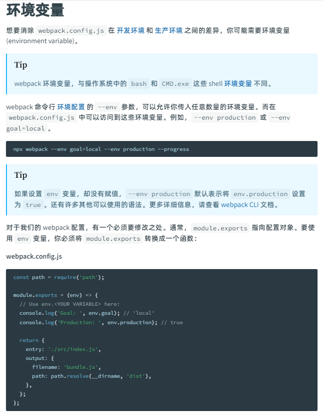

1. 简述环境变量: 环境变量可以消除 webpack.config.js 在开发环境与生产环境之间的差异(webpack 的环境变量和操作系统里面的 bash 和 sheel 环境变量不同)

2. 使用环境变量

   - sheel 命令获取环境变量

     ```js
     // 注意: 如果sheel设置环境变量(env),--env production 默认表示将env,production设置为true

     // webpack命令行 环境配置的--env参数,允许传入任意数量的环境变量,在webpack.config.js中可以访问获取到这些环境变量

     // 执行下列sheel语句,在webpack.config.js中获取环境变量,并根据环境变量进行操作
     npx webpack --env goal=local --env production --progress

     // webpack.config.js
     const path = require('path');
     const HtmlWebpackPlugin = require('html-webpack-plugin');

     /**
     * 设置module.exports以函数形式调用
     * @param {object} env 环境变量
     * @returns webpack.config webpack配置
     */
     module.exports = env => {
       let envData = env;
       console.log(envData, 'envData');

       console.log(
         {
           entry: envData.entryPath,
           output: {
             filename: '[name].[contenthash].js',
             path: path.resolve(__dirname, envData.outputPathName),
           },
           // 配置插件
           plugins: [
             // 设置htmlwebpackplugin参数
             new HtmlWebpackPlugin({
               title: envData.title,
             }),
           ],
         },
         'config'
       );

       // 通过环境数据动态设置webpack配置
       return {
         entry: envData.entryPath,
         output: {
           filename: '[name].[contenthash].js',
           path: path.resolve(__dirname, envData.outputPathName),
         },
         // 配置插件
         plugins: [
           // 设置htmlwebpackplugin参数
           new HtmlWebpackPlugin({
             title: envData.title,
           }),
         ],
       };
     };

     // package.json 自定义scripts
     "scripts": {
        "build": "webpack --env entryPath=/src/index.js outputPathName=sheelEnvDist --env production --env title=webpack环境变量(通过shell脚本获取环境变量)"
      },
     ```

   - 环境变量文件获取环境变量

     ```js
     // 1. 项目根目录创建环境变量文件
     .env.development // 开发环境的环境变量文件
     .env.production // 测试环境的环境变量文件
     .env.test // 测试环境的环境变量文件

     // 2. 编辑环境变量文件内容

     // .env.development
     ###
      # @Author: wangzhiyu
      # @Date: 2023-08-30 21:56:08
      # @LastEditors: wangzhiyu
      # @LastEditTime: 2023-08-30 22:06:21
     ###

     NODE_ENV = development
     entryPat = /src/index.js
     outputPathName = developmentDist
     title = webpack环境变量(通过环境变量文件获取环境变量)development环境

     // .env.production
     ###
      # @Author: wangzhiyu
      # @Date: 2023-08-30 21:56:20
      # @LastEditors: wangzhiyu
      # @LastEditTime: 2023-08-30 22:06:11
     ###

     NODE_ENV = production
     entryPat = /src/index.js
     outputPathName = productionDist
     title = webpack环境变量(通过环境变量文件获取环境变量)production环境

     // 3. 配置webpack
     // webpack.config.js
     const path = require('path');
     const HtmlWebpackPlugin = require('html-webpack-plugin');

     // 通过dotenv库获取到.env.development环境下的配置
     const envData = require('dotenv').config({ path: '.env.development' }).parsed;

     module.exports = {
       entry: envData.entryPath,
       mode: 'development',

       output: {
         filename: '[name].[contenthash].js',
         path: path.resolve(__dirname, envData.outputPathName),
       },
       // 配置插件
       plugins: [
         // 设置htmlwebpackplugin参数
         new HtmlWebpackPlugin({
           title: envData.title,
         }),
       ],
     };

     // 4. 执行打包,查看结果
     npm run build
     ```

### 9. [构建性能](https://webpack.docschina.org/guides/build-performance/)

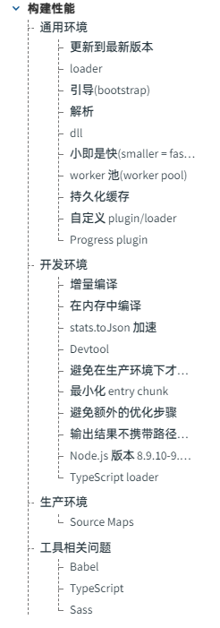

1. 通用环境

   ```js
   // 通用环境构建优化的方式
   // 1. 更新webpack到最新的版本(2023.09.03时最稳定的版本为webpack@5.88.2)

   // 2. 将loader应用于少数的文件中,如果其他文件并非必须需要的话,可以使用webpack.module.rules.include字段进行筛选,更精确的筛选哪些文件需要被应用此loader

   // 3. 需要注意每个loader以及plugin都需要一定的启用时间以及资源消耗,应该在允许的情况下尽量少的使用工具

   // 4. 修改webpack.config.js以提高解析速度,有以下几点
   //     1. 减少 resolve.modules, resolve.extensions, resolve.mainFiles, resolve.descriptionFiles 中的条目数量,因为会增加文件系统调用的次数
   //     2. 如果使用 symlinks(例如 npm link 或者 yarn link),可以设置 resolve.symlinks: false,webpack就会直接使用链接本身所指向的路径进行模块解析
   //     3. 如果使用自定义的plugin,并且没有指定content上下文,可以设置resolve.cache.WithContent:false,webpack就会只基于模块的路径来缓存解析结果,而不考虑模块的内容,这也就表示模块的内容发生了变化,但是路径没有改变时,webpack仍然会使用缓存的解析结果

   // 5. 使用webpack的DllPlugin插件提高编译速度,DllPlugin可以为更改不频繁的代码单独生成编译结果,这样可以提高应用程序的编译速度,虽然它也会增加构建过程的复杂度

   // 6. 基于webpack的小即是快的原则,减少编译结果的整体大小,来提高构建性能,尽量保证chunk的体积较小,可以使用以下几个方法
   //     1. 使用数量更少,体积更小的library
   //     2. 在多页面应用程序使用SplitChunkPlugin,并开始async模块,移除没有引用的代码
   //     3. 只编译当前正在开发的代码

   // 7. 使用webpack的worker池,用它来执行耗时的任务,主要目的是提高构建的性能和使用多核处理器的能力,但是注意,不要使用太多的worker,因为nodejs的runtime和loader都有启动的性能开销,最小化worker和main process(主进程)之间的模块传输,进程之间的通讯是非常消耗资源的

   // 8. 持久化存储,在webpack配置中使用cache选项,使用package.json的"postinstall"清除缓存目录

   // 9. 自定义loading和plugin,并对它们进行概要的分析,避免引入性能问题

   // 10. webpack中移除Progress plugin,这样可以缩短构建事件,因为它不会为快速构建提供太多价值
   ```

2. 开发环境

   ```js
   // 1. 增量编译,使用webpack的watch mode(监听模式),而不是使用其他工具来watch文件和调用webpack,内置的watch mode会记录时间戳并将此信息传递给compilation,使缓存失效,代码更新. 并且在某些配置环境中,watch mode会回退到poll mode(轮询模式) 监听许多文件会导致CPU大量负载,这种情况可以使用watchOptions.poll来增加轮询的间隔时间

   // 2. 在内存中进行编译,而并非写入磁盘中,可以使用webpack-dev-serve和webpack-hot-middleware等工具编译和serve资源来提高性能

   // 3. 避免在生产环境中才会遇到的工具,某些utility,plugin和loader都只用与生产环境,例如,在开发环境里面使用TerserPlugin来minify(压缩)代码时没有任何的作用与意义的,所以应该在开发环境排除这些工具,例如TerserPlugin,AggressiveSplittingPlugin......

   // 4. 最小化entry chunk,这样可以加快webpack的构建速度,并且提供更好的开发体验

   // 5. 避免额外的优化步骤,因为webpack通过执行额外的算法来优化输出结果与体积和加载性能,但是这些只优化适用于小型代码库,在大型代码库中比较消耗性能

   // 6. 输出结果不携带路径信息,因为webpack会在输出的bundle中生成路径信息,但是在打包的模块中,这会导致垃圾回收的性能压力,可以配置output.pathingo:false关闭\

   // 7. 尽量避免使用Node.js版本为8.9.10-9.11.1,因为这些nodejs版本中的ES2015的Map与Set格式性能不如其他版本,webpack在构建过程中大量的使用了这些数据结果,因此会影响编译时间

   // 8. 使用TypeScript Loader,传入transpileOnly选项,可以缩短使用ts-loader的构建时间,使用这个选项,也会关闭类型检查,如果再次启用类型检查,需要使用ForkTsCheckerWebpackPlugin,它会将检查过程移动到单独的吓死你称重,可以加快ts的类型检查和eslint插入的速度
   ```

3. 生产环境

   ```js
   // 1. 解除或禁用Source Maps,它是将打包后的代码映射回源代码的工具,但是同时他也会占用大量的资源和文件大小,在生产环境中,需要考虑到实际情况来决定是否使用Socurce Maps

   // 2. 代码压缩与混淆,可以使用压缩工具UglifyJS,Terser等工具对代码进行压缩与混淆,可以减少代码的体积来提高运行时的性能

   // 3. 静态资源优化,使用何时的压缩算法或者压缩工具对静态资源进行压缩,并使用适当的缓存策略,这样可以减少静态资源的体积,提高加载静态资源的速度

   // 4. 服务端渲染(SSR),将渲染页面放到服务端中,这样可以打打减少客户端的初始化加载时间,并且可以有助于SEO优化
   ```

### 10. [内容安全策略](https://webpack.docschina.org/guides/csp/)

1. webpack 的内容安全策略简介

   webpack 的内容安全策略(简称为 CSP)是一种安全机制,可以防止跨站脚本工具(XSS)和其他代码注入攻击. webpack 可以给源码中所有可以加载的脚本添加 nonce,以保证经过验证的脚本才可以执行

2. 开启 webpack 的内容安全策略

   在 webpack 的入口脚本中设置一个\_webpack_nonce\_变量,应该为每一个唯一的页面生成和提供一个基于 hash 的 nonce,这也是为什么\_webpack_nonce\_要在入口文件中指定,而不是在 webpack 配置文件中指定的原因,\_webpack_nonce\_应该是一个 base64 格式的字符串

   ```js
   // 设置_webapck_nonce_
   _webpack_nonce_ = 'c29tZSBjb29sIHN0cmluZyB3aWxsIHBvcCB1cCAxMjM=';

   // 项目中启用内容安全策略
   // html文件中的同步设置meta标签的 Content-Security-Policy 头,来告诉浏览器启用CSP
   <meta http-equiv="Content-Security-Policy" ...>

   // 包含CDN白名单的URL header的示例
   Content-Security-Policy: default-src 'self'; script-src 'self'
   https://trusted.cdn.com;
   ```

3. Trusted Types

   Trusted Types 是 webpack 的一个功能,允许开发者使用动态构建脚本,来满足 CSP require-trusten-types-for 指令的限制,可以在 output.trustedTypes 配置选项中查看此选项

### 11. [开发 - Vagrant](https://webpack.docschina.org/guides/development-vagrant/)

1. 简介: 如果需要开发一个较为高级的项目,并且使用 Vagrant 来实现在虚拟机上运行开发环境,那么就可能需要在虚拟机中运行 webpack

2. 项目配置

   ```js
   // 1. 配置 Vagrantfile 静态ip
   Vagrant.configure("2") do |config|
    config.vm.network :private_network, ip: "10.10.10.61"
   end

   // 2. 项目安装依赖
   npm install --save-dev webpack webpack-cli @webpack-cli/serve webpack-dev-server

   // 3. 创建webpack.config.js
   // webpack.config.js
   module.exports = {
    context:__dirname,
    entry:'./index.js'
   }

   // 4. 创建index.html文件,并且指定js的src
   // index.html
   <!DOCTYPE html>
    <html>
      <head>
        <script src="/bundle.js" charset="utf-8"></script>
      </head>
      <body>
        <h2>Hey!</h2>
      </body>
    </html>

   // 5. 创建index.js文件,作为项目入口
   // index.js
   console.log('这里是index.js')

   // 6. 启动项目
   webpack serve --host 0.0.0.0 --client-web-socket-url ws://10.10.10.61:8080/ws --watch-options-poll
   ```

3. 配合 nginx 的高级用法

   ```js
   // nginx配置文件中添加以下代码,可以更好的模拟环境
   server {
     location / {
       proxy_pass http://127.0.0.1:8080;
       proxy_http_version 1.1;
       proxy_set_header Upgrade $http_upgrade;
       proxy_set_header Connection "upgrade";
       error_page 502 @start-webpack-dev-server;
     }

     location @start-webpack-dev-server {
       default_type text/plain;
       return 502 "Please start the webpack-dev-server first.";
     }
   }
   ```

### 12. [依赖管理](https://webpack.docschina.org/guides/dependency-management/)

### 13. [安装](https://webpack.docschina.org/guides/installation/)

### 14. [模块热替换(webpack 的核心概念点中第 12 条有介绍)](https://webpack.docschina.org/guides/hot-module-replacement/)

### 15. [Tree Shaking](https://webpack.docschina.org/guides/tree-shaking/)

### 16. [生产环境](https://webpack.docschina.org/guides/production/)

### 17. [懒加载](https://webpack.docschina.org/guides/lazy-loading/)

### 18. [ECMAScript 模块](https://webpack.docschina.org/guides/ecma-script-modules/)

### 19. [Shimming 预置依赖](https://webpack.docschina.org/guides/shimming/)

### 20. [TypeScript](https://webpack.docschina.org/guides/typescript/)

### 21. [Web Workers](https://webpack.docschina.org/guides/web-workers/)

### 22. [渐进式网络应用程序](https://webpack.docschina.org/guides/progressive-web-application/)

### 23. [公共路径](https://webpack.docschina.org/guides/public-path/)

### 24. [集成](https://webpack.docschina.org/guides/integrations/)

### 25. [资源模块](https://webpack.docschina.org/guides/asset-modules/)

### 26. [entry 高级用法](https://webpack.docschina.org/guides/entry-advanced/)

### 27. [Package exports](https://webpack.docschina.org/guides/package-exports/)
